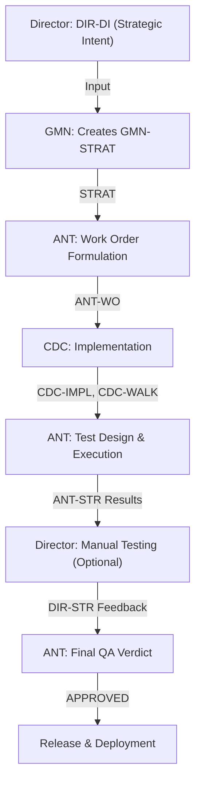

# Project Strategy

> [!IMPORTANT] **Input Requirement**: Requires `DIR-DI-002-v1.0` (Director's Intent) before this document is created. **Scale Rule**: This document is used for medium-to-large projects. Small/PoC projects proceed directly from DIR-DI to Planning Layer. **AI Execution Note**: This document is structured as a deterministic instruction system. Read Section 0 in full before processing any other section.

---

## 1. Metadata

| Field              | Value                                     |
|:------------------ |:----------------------------------------- |
| **Project ID**     | 002                                       |
| **Project Name**   | MO2 Hardlink Builder V4                   |
| **Document Type**  | Project Strategy (STRAT)                  |
| **Status**         | Draft                                     |
| **Lead Architect** | GMN (Global System Architect)             |

---

<!-- ============================================================ -->

<!-- [BLOCK: CONTROL — MASTER OVERRIDE] -->

<!-- Highest authority layer. Overrides all lower sections. -->

<!-- ANT must read this section completely before any other. -->

<!-- ============================================================ -->

## 0. Strategic Control Layer

> **Authority**: This section overrides all other sections in case of conflict. **Scope**: Defines intent, hierarchy, enforcement rules, and execution gates.

---

### 0a. Core Intent

| Field                       | Value                                                                                                                          |
| --------------------------- | ------------------------------------------------------------------------------------------------------------------------------ |
| **Problem Being Solved**    | MO2's Virtual File System (VFS) hits physical limits at 2000+ modlists — external tools refuse VFS injection, performance degrades, and silent failures (load order corruption, lost saves) destroy user trust. |
| **Expected Outcome**        | A defensive, traceable tool that mirrors an MO2 profile into a standalone physical game folder via NTFS hardlinks (zero extra disk space), with crash-aware save syncing, preflight diagnostics, and full operational transparency. |
| **Primary Value Delivered** | Heavy modders (1000+ mods) gain a stable, external-tool-compatible game environment that preserves exact load order parity and protects save files from corruption — without doubling disk usage. |

---

### 0b. Critical Decisions *(Top 3 — immutable without Director approval)*

> These are the three decisions that define the project's strategic posture.
> Changing any of these requires a new DIR-DI and STRAT revision.

1. **Decision 1**
   - statement: Prioritize Correctness & Traceability over Raw Speed
   - measurable_effect: 90% reduction in ambiguous launch failures; every operation logged with explicit verification method
   - trade_off:
   - prioritize: Deterministic, auditable builds
   - sacrifice: Raw deployment speed (a slower-but-verifiable build beats a fast silent-failure build)
   - boundary:
   - allowed: Multi-phase verification (Quick → Sampled → Full), explicit fallback logs, diagnostic attribution reports
   - not_allowed: Skipping verification to save time, silent fallbacks, black-box optimization shortcuts
2. **Decision 2**
   - statement: Windows/NTFS-only — Deep OS integration over Cross-platform support
   - measurable_effect: 100% inode parity on NTFS; zero-space hardlinks; Shell API path resolution
   - trade_off:
   - prioritize: NTFS hardlink performance + Windows Shell API correctness
   - sacrifice: Linux, macOS, and non-NTFS filesystem support
   - boundary:
   - allowed: Python 3.10+ on Windows 10/11, C# wrapper for Native sync, PySide/PyQt GUI
   - not_allowed: Any cross-platform abstraction layer that weakens NTFS-specific guarantees
3. **Decision 3**
   - statement: Faithful 1:1 MO2 Mirror — never interpret, always replicate
   - measurable_effect: 100% state parity between MO2 profile and standalone folder; stack-based ownership resolution matches MO2 priority exactly
   - trade_off:
   - prioritize: Exact replication of MO2's resolved file state (including overrides, BSAs, script extenders)
   - sacrifice: Automatic mod conflict resolution, "smart" mod fixing, profile optimization suggestions
   - boundary:
   - allowed: Reading MO2 API (mobase) for ground truth, deterministic priority resolution, user-facing diagnostic reports
   - not_allowed: Modifying MO2 profile data, auto-disabling broken mods, altering load order without user consent

---

### 0c. Non-Negotiable Constraints *(Canonical source — do not duplicate elsewhere)*

> [CONSTRAINT] All binding constraints live here. Other sections may reference these by ID but must NOT restate them.

| Constraint ID | Constraint Statement                                                                      | Origin |
| ------------- | ----------------------------------------------------------------------------------------- | ------ |
| **CON-001**   | Must run on Windows 10/11, NTFS volumes only — no cross-platform support                  | DIR-DI |
| **CON-002**   | Must NOT require administrator privileges                                                 | DIR-DI |
| **CON-003**   | Must NOT modify MO2's internal files, profile data, or mod directories                    | DIR-DI |
| **CON-004**   | Target standalone folder MUST be on the same NTFS drive as MO2 mods folder                | DIR-DI |
| **CON-005**   | C# wrapper must compile and function without .NET SDK installed (embed or batch fallback) | DIR-DI |
| **CON-006**   | Save files must NEVER be silently overwritten — quarantine on conflict, skip sync on crash | DIR-DI |
| **CON-007**   | Every hardlink-to-copy fallback must be explicitly logged and reported to user             | DIR-DI |
| **CON-008**   | Deployment must be resumable after interruption (transactional checkpoints every 500 files) | DIR-DI |

---

### 0d. Instruction Hierarchy *(Conflict resolution order)*

> When two sections produce conflicting signals, the higher-numbered tier loses.

| Tier | Source                                            | Authority                            |
| ---- | ------------------------------------------------- | ------------------------------------ |
| 1    | DIR-DI (Director's Intent)                        | Absolute — upstream of this document |
| 2    | Section 0: Strategic Control Layer (this section) | Master override                      |
| 3    | Section 5d: ADR Level 1 (Non-Negotiable)          | Architecture lock                    |
| 4    | Section 2b: Success Indicators                    | Outcome measurement                  |
| 5    | Section 3a: Functional Requirements               | Execution scope                      |
| 6    | Section 5b: Risk Constraints                      | Risk-adjusted behavior               |
| 7    | Section 5d: ADR Level 2–3                         | Guided/preferred methods             |
| 8    | All other sections                                | Context only                         |

**Conflict Resolution Rules**:

- If Tier N conflicts with Tier M where N < M → Tier N wins. Document the conflict in Section 4d.
- If two items within the same tier conflict → HALT. Escalate to Director before proceeding.
- No implicit merging of conflicting instructions is permitted.

---

### 0e. Anti-Ambiguity Enforcement *(Hard rules for ANT)*

> [CONSTRAINT] These rules are non-waivable. Violation is grounds for WO rejection.

- **RULE-AA-01**: ANT must NOT make assumptions to fill missing information. If a required field is empty, HALT and request clarification from GMN/Director.
- **RULE-AA-02**: ANT must NOT reinterpret constraints beyond their literal statement. If a constraint is ambiguous, escalate — do not infer.
- **RULE-AA-03**: ANT must NOT optimize beyond the stated success indicators in Section 2b. "Better" is defined only by what is measurable there.
- **RULE-AA-04**: ANT must NOT proceed if `system_status` in Section 5a is `BLOCKED`.
- **RULE-AA-05**: When in doubt between two valid interpretations, choose the one that is MORE conservative (less scope, less risk).

#### Constraint Compliance Rule

Before finalizing any Work Order (WO), ANT MUST:  

1. Check each WO item against all CON-NNN  
2. Explicitly state:  
- which CON it satisfies  
- or confirm no violation  
3. If violation detected → REJECT WO draft and revise  

No WO is valid without constraint compliance confirmation.

---

### 0f. Critical Execution Focus *(Highest failure-risk areas)*

> ANT must apply maximum caution in these areas during WO generation.
> These are where STRAT is most likely to be violated in implementation.

| Focus Area                         | Why It's Risky                                                                           | Watch-Out                                                                                         |
| ---------------------------------- | ---------------------------------------------------------------------------------------- | ------------------------------------------------------------------------------------------------- |
| **Load Order Resolution (RAM Manifest)** | Ownership stack corruption produces silent wrong-hardlink bugs that users cannot detect  | Must enforce invariant check `top_of_stack == active_owner`; abort build on mismatch               |
| **Save File Sync (Wrapper)**       | A single sync bug can destroy 200+ hours of player progress — trust is lost permanently   | Crash detection must be reliable; quarantine path must be explicit; never overwrite silently        |
| **Incremental Update Path**        | File-level stat storms previously caused incremental builds to be slower than full builds | Tri-gate detection must be correct; false-negative skip → outdated hardlink; false-positive → I/O storm |
| **Preflight Environment Sensing**  | AV/OneDrive interference is silent and non-deterministic                                  | Must detect and attribute, not silently retry. "Hostile Environment" alert is mandatory.           |

**ENFORCEMENT RULE**:

- If WO touches any Focus Area → ANT must explicitly explain handling strategy
- If not addressed → WO is invalid

---

### 0g. Failure Definition

> Success is defined in Section 2b. Failure is defined here.

- **MVP Failure**: A user with a 500+ modlist cannot complete a full Build → Launch → Play → Exit → Save Synced cycle without encountering an unrecoverable error or silent data corruption.
- **Launch Blocker**: Any condition where load order is silently corrupted (standalone folder does NOT match MO2 priority resolution), OR save files are lost/overwritten without quarantine, OR the wrapper fails to inject plugins.txt and launches the game in a vanilla state without blocking.
- **Acceptable Degraded State**: C# wrapper unavailable → batch launcher fallback with explicit warning (manual save sync required). Cross-drive build → full file copy instead of hardlinks with space warning. AV blocks → diagnostic report with explicit attribution, user retries after whitelisting.

---

### 0h. MVP Status *(Fast Signal)*

```
system_status: SAFE

SAFE:        No unmitigated fatal risks. Proceed with confidence.
CONDITIONAL: Blocking risks exist but mitigations are in place. Proceed with conditions.
BLOCKED:     One or more fatal risks unmitigated. DO NOT PROCEED.

Last Updated: 2026-05-13 17:20
Derived From: 4 fatal risks identified, all mitigated via explicit safeguards (see RR-001 through RR-004); 2 degrading risks accepted with conditions; 1 noise risk deferred
```

---

<!-- ============================================================ -->

<!-- [BLOCK: CONTEXT — STRATEGIC BACKGROUND] -->

<!-- Provides rationale and goals. Not execution instructions. -->

<!-- ============================================================ -->

## 2. Strategic Vision

### 2a. Problem & Solution

- **Problem Statement**: Mod Organizer 2's Virtual File System (VFS) is a masterpiece of mod management, but it has physical limits. When load orders exceed 2000+ mods, external tools (DynDOLOD, xLODGen, ENBs) refuse VFS injection, performance degrades, and silent failures — load order corruption, save file loss, environmental interference from AV and OneDrive — destroy user trust. V3's fragile approach to these problems (no preflight checks, no crash detection, no diagnostic attribution) caused user drop-off.

- **Proposed Solution**: MO2 Hardlink Builder V4 is a defensive, traceable tool that mirrors an MO2 profile into a standalone physical game folder using NTFS hardlinks (zero additional disk space). It reads load order from MO2's API, resolves file conflicts deterministically via a dual-layer RAM manifest, deploys via transactional checkpoints with resume capability, and wraps the game in a crash-aware launcher that manages load order injection and save syncing with quarantine protection. Every operation is logged with its verification method — nothing is silent, nothing is a black box.

- **Primary Value Proposition**: Heavy modders gain a stable, external-tool-compatible game environment that preserves exact load order parity, protects save files from corruption, and updates in seconds — without doubling disk usage.

---

### 2b. Strategic Goals & Success Indicators

> [DECISION] These are the measurable definitions of success. ANT must ensure WOs trace back to at least one indicator.

- **Primary Objective**: Implement "The Traceable Mirror" — a system that maintains a deterministic link to the MO2 state and provides observable evidence for every operation.

- **Success Indicator 1 — Ambiguity Reduction**: 90% reduction in "Ambiguous Launch Failures" through explicit failure attribution (Tool vs. Mod vs. Environment). Measured by: user bug reports classified as "ambiguous" before and after V4 release.

- **Success Indicator 2 — Verification Velocity**: Re-verification of 50,000+ files in under 3 minutes with a clear "Integrity Proof" report. Measured by: automated benchmark on reference 1000-mod profile.

- **Success Indicator 3 — Fallback Awareness**: 100% visibility into hardlink-to-copy fallback events; no more silent pseudo-hardlinks. Measured by: every fallback event appears in deployment report with explicit reason.

- **Success Indicator 4 — Deployment Speed**: Incremental updates complete in <30 seconds for a 1000+ modlist when <5 mods changed. Measured by: automated benchmark on reference profile with controlled mod changes.

- **Success Indicator 5 — State Parity**: 100% load order parity between MO2 profile and standalone folder. Measured by: ANT-STR automated test suite validating ownership correctness against MO2 priority resolution.

---

### 2c. Core Constraints

> [CONTEXT] This section is a SUMMARY VIEW ONLY. **Canonical source**: Section 0c (Non-Negotiable Constraints).
> Do not add new constraints here. Reference by CON-ID only.

- Summary: See CON-001 through CON-008 in Section 0c.
- Strategic rationale for each constraint is noted in DIR-DI-002-v1.0.

---

### 2d. Required Agent Skills

> [DECISION] List the strategic agent skills required for this project, selected from `Delta/05_References/SKILLS_CATALOG.md`. These choices guide the developer (CDC) in activating specific skills in their `CDC-IMPL` plans.

- [ ] **SKILL-PythonBestPractices**: Required for engine implementation — type hints, pathlib, concurrent.futures, dataclasses
- [ ] **SKILL-WindowsNativeDevelopment**: Required for C# wrapper, NTFS hardlink operations, Shell API path resolution
- [ ] **SKILL-GUIDevelopment**: Required for PySide6/PyQt6 UI implementation (config panel, progress panel, report viewer)
- [ ] **SKILL-TestAutomation**: Required for ANT-STR test suite design and execution

---

<!-- ============================================================ -->

<!-- [BLOCK: DECISION — EXECUTION BINDING] -->

<!-- Defines what must be built. ANT generates WOs from this. -->

<!-- ============================================================ -->

## 3. Functional Requirements

### 3a. User Stories & Acceptance Criteria

> **Format**: `As a [role], I want to [action], so that [benefit].` The "so that [benefit]" clause is mandatory — it defines WHY and must not be removed.
> Acceptance Criteria must be strictly measurable. Avoid narrative criteria.

---

**REQ-001**: Profile Selection & MO2 Integration `Priority: Must-Have`

- **User Story**: As a heavy modder, I want to select my active MO2 profile and have the tool automatically resolve my load order, so that my standalone folder exactly mirrors what MO2 would load at runtime without manual configuration.
- **Acceptance Criteria**:
  - [ ] Tool reads `modlist.txt` and `loadorder.txt` from the selected MO2 profile
  - [ ] Tool resolves file conflicts using MO2 priority order (higher-priority mod overwrites lower)
  - [ ] If MO2 API (`mobase`) is available, use it as authoritative source; if unavailable, report explicit "API Link Failure" and halt
  - [ ] All resolved ownerships are stored in a dual-layer RAM manifest (Layer A: Mod→Files, Layer B: VirtualPath→OwnerStack)
  - [ ] Invariant check `top_of_stack == active_owner` passes before any deployment

**REQ-002**: NTFS Hardlink Deployment `Priority: Must-Have`

- **User Story**: As a user with limited SSD space, I want the tool to deploy my mod files via NTFS hardlinks, so that I get a complete standalone game folder without duplicating hundreds of gigabytes of files.
- **Acceptance Criteria**:
  - [ ] Files are deployed as NTFS hardlinks when source and target are on the same NTFS volume
  - [ ] When hardlink fails, tool falls back to file copy AND explicitly logs the fallback with reason
  - [ ] Cross-drive builds are blocked with a prominent warning; user must explicitly confirm to proceed
  - [ ] Deployment is transactional — interrupted builds can be resumed from the last checkpoint (every 500 files)
  - [ ] 100% inode parity on supported NTFS volumes

**REQ-003**: Incremental Updates via Tri-Gate Change Detection `Priority: Must-Have`

- **User Story**: As a user who frequently tweaks mods, I want to update my standalone folder in seconds — not minutes — when only a few mods changed, so that I don't dread re-running the builder after every small adjustment.
- **Acceptance Criteria**:
  - [ ] **Gate 1**: Hash `modlist.txt` — if changed, trigger RAM-only global ownership recompute without re-scanning unchanged mods
  - [ ] **Gate 2**: Check mod root `mtime` + `meta.ini` mtime + `file_count` + lightweight sampling fingerprint — if all match manifest, skip the mod entirely
  - [ ] **Gate 3**: Only for mods that fail Gate 1 or Gate 2, perform multi-threaded `os.scandir` scoped exclusively to that mod
  - [ ] Incremental update on a 1000+ modlist with <5 changed mods completes in <30 seconds
  - [ ] False-negative skip (mod changed but not detected) must never occur

**REQ-004**: Action Queue Execution (Idempotent Linker) `Priority: Must-Have`

- **User Story**: As a user, I want the deployment phase to be fast and deterministic, so that re-running the builder always produces the exact same result without redundant I/O.
- **Acceptance Criteria**:
  - [ ] Linker computes diff between old manifest Layer B and new RAM state → produces Absolute Action Queue: `[(DELETE, path), (LINK, src, dst), ...]`
  - [ ] Execution is phased: Phase 1 (all DELETEs), then Phase 2 (all LINKs) — no interleaving
  - [ ] All LINK operations use force-overwrite; zero `os.stat` or inode verification calls during execution
  - [ ] Executing the same queue twice yields identical filesystem state (idempotent)
  - [ ] Locked/in-use files produce logged errors without halting parallel execution threads

**REQ-005**: Game Wrapper Generation (C# + Batch Fallback) `Priority: Must-Have`

- **User Story**: As a user, I want the tool to generate a game launcher that automatically manages my load order and saves, so that I don't need to manually copy files every time I play.
- **Acceptance Criteria**:
  - [ ] Primary: Generate a C# wrapper executable that, at runtime: (a) atomically injects `plugins.txt` and `loadorder.txt` into `%LOCALAPPDATA%\<Game>`, (b) syncs saves from MO2 → standalone before launch, (c) syncs saves back from standalone → MO2 after normal exit
  - [ ] Fallback: If C# compilation fails (no .NET SDK, AV block), generate a `.bat` launcher with explicit warning that automatic save sync is disabled
  - [ ] Wrapper detects game crash (exit code, process monitoring) and intentionally skips exit sync to prevent corrupted memory from writing back to MO2
  - [ ] Save file conflicts during sync are quarantined, never silently overwritten
  - [ ] If load order injection fails (files locked/corrupted/missing), wrapper blocks game launch and shows explicit error window + writes `wrapper.log`

**REQ-006**: Preflight Environment Sensing `Priority: Must-Have`

- **User Story**: As a user, I want the tool to detect problems before they cause failures, so that I don't waste time on a build that's doomed by antivirus or OneDrive interference.
- **Acceptance Criteria**:
  - [ ] Before deployment, probe target directory for: active file locks (detect PIDs holding game files), OneDrive sync conflicts, Windows Defender real-time protection status
  - [ ] If hostile conditions detected → pause build, display Attribution Report with specific cause, offer [Retry] / [Abort]
  - [ ] Cross-drive detection: if target is on a different drive than MO2 mods, show prominent warning before proceeding
  - [ ] Detection failures must not block the build — log and proceed with warning

**REQ-007**: Deployment Report (HTML) `Priority: Should-Have`

- **User Story**: As a user, I want a clear, actionable report after every build, so that I know exactly what was linked, skipped, or failed — without guessing.
- **Acceptance Criteria**:
  - [ ] HTML report with categorized sections: Linked, Skipped (unchanged), Failed (with reason), Quarantined
  - [ ] "Show Report" button available in UI after build completes + option to auto-open
  - [ ] Report includes: total file count, hardlink vs copy count, fallback events with reasons, preflight diagnostic results, build duration

**REQ-008**: Game Profile Abstraction `Priority: Should-Have`

- **User Story**: As a user with multiple Bethesda games, I want the tool to support different game titles via a configuration file, so that I can use the same tool for Skyrim, Fallout 4, and Starfield.
- **Acceptance Criteria**:
  - [ ] `game_profiles.json` defines per-game: AppData paths, Documents paths, executable name, recognized plugin formats
  - [ ] Adding a new game requires only a new profile entry — no code changes
  - [ ] Profile is auto-detected from MO2 instance if possible, fallback to manual selection

**REQ-009**: Error Attribution & Diagnostics `Priority: Should-Have`

- **User Story**: As a user, I want failures to tell me whose fault it is — the tool, the mod, or the environment — so that I can fix the right thing instead of guessing.
- **Acceptance Criteria**:
  - [ ] Every error is classified: TOOL_FAULT, MOD_FAULT, ENV_FAULT (OS/AV/OneDrive)
  - [ ] Errors include actionable next steps (e.g., "Whitelist this folder in Windows Defender", "Disable OneDrive for this directory")
  - [ ] 90% reduction in "Ambiguous Launch Failure" reports compared to V3 baseline

---

### 3b. WO Validation Requirement

Each WO must include:

- Linked REQ-ID
- Linked Success Indicator
- Referenced CON-ID (if applicable)

Validation checklist:

- Does this WO directly support a Success Indicator? [Yes/No]
- Does this WO violate any CON? [Yes/No]
- Is this WO within defined scope boundaries? [Yes/No]

If any answer = No → revise before proceeding

---

### 3c. Technical Constraints

> [CONTEXT] Pointer section only. Binding constraints are in Section 0c.

- **Input Data**: MO2 profile directory (`modlist.txt`, `loadorder.txt`, `meta.ini` per mod, mod directories); MO2 API (`mobase`) for authoritative load order. Volume: 500–2000+ mods, 50K–500K+ files.
- **Performance Requirements**: Incremental build <30s for low-delta updates on 1000+ modlist. Fresh build acceptable at longer duration (minutes). Re-verification of 50K+ files in <3 minutes. See CON-004 (same-drive constraint).
- **Scalability Requirements**: Must handle 2000+ mods with 500K+ files without OOM. RAM manifest must be memory-efficient (Layer A + Layer B structures). Multi-threaded scanning for Gate 3.
- **Edge Cases**: Empty mod folders, mods with zero files, symlinks within mod directories, Unicode paths, extremely long paths (>260 chars — Windows MAX_PATH), read-only files, files locked by other processes, concurrent MO2 usage during build.

---

### 3d. Security & Governance

> [CONSTRAINT] Reference Section 0c for binding security constraints (CON-IDs).
> Items below are implementation guidance, not additional constraints.

- **Data Handling**: Tool reads from MO2 profile but never writes to it (CON-003). Save files are read/synced with quarantine protection (CON-006). No data leaves the local machine. No telemetry. No network access.
- **Security Guidance**: C# wrapper compilation must run without elevated privileges. Executable signing is not required for MVP. Batch fallback must not introduce command injection vectors.
- **Compliance**: Not applicable — this is a local desktop tool with no PII, no network features, no multi-user scenario.

---

<!-- ============================================================ -->

<!-- [BLOCK: CONTEXT — WORKFLOW] -->

<!-- Defines roles and execution sequence. Informational for ANT. -->

<!-- ============================================================ -->

## 4. System Flow

### 4a. Participant Roles

| Phase                      | Primary Role | Responsibility                                    |
| -------------------------- | ------------ | ------------------------------------------------- |
| Strategic Intent           | Director     | Provides DIR-DI; defines vision and scope         |
| Strategy Document Creation | GMN          | Creates this STRAT document from DIR-DI           |
| Work Order Formulation     | ANT          | Translates STRAT into technical work orders (WO)  |
| Implementation             | CDC          | Executes work orders; produces IMPL and WALK docs |
| QA & Testing               | ANT          | Validates implementation against STRAT goals      |
| Director Validation        | Director     | Manual testing; final sign-off                    |

---

### 4b. Sequential Logic

1. **Director** creates `DIR-DI` with strategic vision and scope.
2. **GMN** creates `GMN-STRAT` from DIR-DI — this document.
3. **ANT** formulates `ANT-WO` from STRAT.
4. **CDC** executes implementation; produces `CDC-IMPL` and `CDC-WALK`.
5. **ANT** designs and runs test plan (`ANT-STR`); validates against Section 2b success indicators.
6. **Director** conducts manual testing (`DIR-STR`) on-demand; issues final sign-off.

---

### 4c. Flow Diagram



---

### 4d. Edge Cases, Conflicts & Failure Paths

> [DECISION] Document ALL known conflicts here. This section is the single log for deviation and escalation.

**Scenario A: STRAT requirements conflict with DI**

- GMN documents the conflict here with timestamp.
- Escalate to Director with resolution options.
- Do NOT proceed to ANT-WO until alignment is confirmed.

**Scenario B: Director Issues Feedback During Implementation**

- Director creates `DIR-STR` with new requirements or feedback.
- GMN evaluates: Does feedback require STRAT revision?
  - **If YES** → Update GMN-STRAT version; ANT revises WO accordingly.
  - **If NO** → ANT incorporates feedback directly into refined WO or test plan.

**Scenario C: CDC Implementation Deviates from STRAT**

- ANT flags deviation against Section 2b success indicators and ADR Level 1.
- If Level 1 violation → REJECT; escalate to GMN.
- If Level 2/3 deviation → ANT evaluates justification; approves if reasonable.

**Scenario D: Risk Materializes During Implementation**

- Refer to Risk Register (Section 5b) for containment strategy.
- Update `system_status` in Section 0h.
- Escalate to Director if fatal risk becomes unmitigated.

**Scenario E: mobase API Unavailable**

- The MO2 API may not be importable (MO2 not installed, wrong Python version, virtual environment issues).
- Tool must detect this at startup, report "API Link Failure", and halt — do not fall back to heuristic parsing silently.

**Scenario F: C# Wrapper Compilation Blocked by AV**

- Windows Defender or third-party AV may quarantine the compiled wrapper.
- Fallback to batch launcher with explicit warning that automatic save sync is disabled.
- Do not attempt to bypass AV — this is a user-environment decision.

**[Active Conflict Log]**

| Conflict ID | Date | Description | Resolution | Status |
| ----------- | ---- | ----------- | ---------- | ------ |
| —           | —    | —           | —          | —      |

---

<!-- ============================================================ -->

<!-- [BLOCK: CONSTRAINT — RISK & ARCHITECTURE] -->

<!-- Defines boundaries. ADR Level 1 = Non-Negotiable. -->

<!-- ============================================================ -->

## 5. Risk & Architecture

### 5a. MVP Decision Status

> Mirror of Section 0h. Update both simultaneously.

```
system_status: SAFE
Last Updated: 2026-05-13 17:20
```

---

### 5b. Risk Register

**Risk Classification:**

| Classification | Definition                                      | MVP Impact  | Launch Decision               |
| -------------- | ----------------------------------------------- | ----------- | ----------------------------- |
| **Fatal**      | If realized → MVP cannot launch or fails        | Blocking    | ❌ Cannot launch unmitigated   |
| **Degrading**  | If realized → MVP works with reduced capability | Conditional | ✓ Launch allowed IF mitigated |
| **Noise**      | Edge case; minimal MVP impact                   | None        | ⊘ Defer; track post-MVP       |

---

**Risk Record Template (Expanded Records):**

```
risk_id: RR-001
classification: fatal
description: Silent load order corruption — ownership stack produces wrong hardlink
business_impact: User's standalone folder does NOT match MO2 priority. All downstream behavior is invalid. User may play for hours before discovering wrong mods loaded.
mvp_blocker: true

likelihood: 2 (Medium — complex stack logic with many edge cases)
severity: 9 (Critical — undetectable by user until symptoms appear)

mitigation_strategy: Invariant check (top_of_stack == active_owner) enforced at multiple points. Abort build on mismatch. ANT-STR test vectors T1-T4 validate correctness.
mitigation_actions:
  - action_id: M1
    description: Implement invariant check in state_manager.py (push_owner, pop_owner, reorder_stack, verify_invariant)
    owner: CDC
    deadline: Before v4.0-RC
    success_criteria: All ANT-STR v3.7 test vectors pass (T1 Pop Fallback, T2 Deep Mod Edit, T3 Reorder, T4 Double Execution)
  - action_id: M2
    description: Implement ANT-STR automated test suite with explicit ownership validation
    owner: ANT
    deadline: Before v4.0-RC
    success_criteria: Test suite runs in <5 minutes; 100% pass rate on ownership correctness vectors

containment_if_occurs: Abort build immediately on invariant failure. Do not deploy. Flag error with stack trace showing expected vs actual owner. User must not be allowed to launch with corrupted state.
residual_risk_level: 2 (after mitigation)

constraint_reference: none (no specific CON covers this directly, but it's a fatal correctness concern)

acceptance_level: accepted
residual_risk_statement: Invariant check + automated test suite reduce likelihood from Medium to Low. Remaining risk is in edge cases not covered by test vectors — mitigated by abort-on-mismatch policy.
verification_authority: GMN
```

```
risk_id: RR-002
classification: fatal
description: Save file destruction — sync logic overwrites or loses MO2 profile saves
business_impact: User loses 200+ hours of gameplay. Trust in tool is permanently destroyed. One incident is enough to kill adoption.
mvp_blocker: true

likelihood: 2 (Medium — file sync is inherently risky; timestamp mismatches, crash edge cases)
severity: 9 (Critical — irreversible data loss)

mitigation_strategy: Quarantine conflicts. Skip sync on crash detection. Atomic file moves with timestamp verification. Never overwrite without explicit quarantine backup.
mitigation_actions:
  - action_id: M1
    description: Implement crash detection in C# wrapper (process exit code monitoring)
    owner: CDC
    deadline: Before v4.0-RC
    success_criteria: Wrapper correctly detects game crash and skips exit sync; wrapper.log records the event
  - action_id: M2
    description: Implement save quarantine logic (move conflicting saves to quarantine/ folder, never overwrite)
    owner: CDC
    deadline: Before v4.0-RC
    success_criteria: Conflicting saves appear in quarantine/ with timestamp; MO2 original is untouched
  - action_id: M3
    description: DIR-STR manual test: create save → exit normally → verify in MO2; create save → force crash → verify MO2 untouched
    owner: Director
    deadline: Before launch
    success_criteria: Normal exit sync works; crash exit does NOT sync corrupted data

containment_if_occurs: Instruct user to restore from MO2 profile backup. Quarantine folder preserves the conflicting version for manual review. If sync logic has bug, disable automatic sync and instruct manual copy.
residual_risk_level: 2 (after mitigation)

constraint_reference: CON-006

acceptance_level: accepted
residual_risk_statement: Crash detection + quarantine reduces likelihood. Remaining risk: edge cases in crash detection (e.g., process killed via Task Manager without exit code). Acceptable because quarantine ensures nothing is lost.
verification_authority: Director
```

```
risk_id: RR-003
classification: fatal
description: Wrapper fails to inject plugins.txt → game launches in vanilla state silently
business_impact: User believes they are playing with mods but game runs vanilla. Hundreds of hours wasted on a "modded" playthrough that never had mods active.
mvp_blocker: true

likelihood: 2 (Medium — file locks, permissions, OneDrive conflicts can block injection)
severity: 8 (Critical — silent failure; user won't know until they notice mods missing)

mitigation_strategy: Atomic file injection with explicit success check. If injection fails, BLOCK game launch and show error window. Never launch in degraded state silently.
mitigation_actions:
  - action_id: M1
    description: Wrapper checks file write success after injecting plugins.txt and loadorder.txt; if any fail, show error window + write wrapper.log, then exit without launching game
    owner: CDC
    deadline: Before v4.0-RC
    success_criteria: Locked plugins.txt triggers error window, game does NOT launch
  - action_id: M2
    description: Preflight check: detect file locks on AppData game folder before build
    owner: CDC
    deadline: Before v4.0-RC
    success_criteria: Locked AppData files reported in Attribution Report before deployment

containment_if_occurs: Error window instructs user to close other game instances, check file permissions, whitelist folder in AV. User retries after resolving lock.
residual_risk_level: 1 (after mitigation)

constraint_reference: none

acceptance_level: accepted
residual_risk_statement: Block-on-failure makes this a visible error, not a silent corruption. Residual risk is near zero — failure mode is user-visible hard block.
verification_authority: GMN
```

```
risk_id: RR-004
classification: fatal
description: Incremental false-negative skip — mod changed but tri-gate detection misses it
business_impact: User's standalone folder contains outdated files. Mod update appears not applied. User loses confidence in incremental build correctness.
mvp_blocker: true

likelihood: 2 (Medium — deep file modifications without mtime change are rare but possible)
severity: 7 (High — undetected until user notices mod behavior mismatch)

mitigation_strategy: Tri-gate detection with multiple signals (root mtime, meta.ini mtime, file_count, sampling fingerprint). Gate 2 must be resilient to deep-file edits. ANT-STR test vector T2 validates.
mitigation_actions:
  - action_id: M1
    description: Implement meta.ini mtime check + file_count comparison in Gate 2; lightweight fingerprint sampling (1-3 deep files)
    owner: CDC
    deadline: Before v4.0-RC
    success_criteria: ANT-STR T2 passes — deep file modification detected and triggers Gate 3 selective scan
  - action_id: M2
    description: Add "Force Full Rebuild" button in UI as user escape hatch
    owner: CDC
    deadline: Before v4.0-RC
    success_criteria: Full rebuild button clears manifest and rescans all mods

containment_if_occurs: User can manually trigger Full Rebuild. Report the specific mod/files that may have been missed via diagnostic log.
residual_risk_level: 2 (after mitigation)

constraint_reference: none

acceptance_level: accepted
residual_risk_statement: Multi-signal detection makes false-negative very unlikely. Force Full Rebuild button gives user a manual override. Residual risk is acceptable.
verification_authority: ANT
```

**Risk Register (Table View):**

| Risk ID | Classification | Description                                     | Likelihood | Severity | MVP Blocker | Status   | Residual | Acceptable | CON Ref  |
| ------- | -------------- | ----------------------------------------------- | ---------- | -------- | ----------- | -------- | -------- | ---------- | -------- |
| RR-001  | fatal          | Silent load order corruption (ownership stack)  | 2          | 9        | true        | mitigated | 2        | true       | none     |
| RR-002  | fatal          | Save file destruction / loss during sync        | 2          | 9        | true        | mitigated | 2        | true       | CON-006  |
| RR-003  | fatal          | Wrapper fails silently → vanilla game launch    | 2          | 8        | true        | mitigated | 1        | true       | none     |
| RR-004  | fatal          | Incremental false-negative skip (stale files)   | 2          | 7        | true        | mitigated | 2        | true       | none     |
| RR-005  | degrading      | C# wrapper compilation blocked by AV            | 3          | 4        | false       | accepted  | 2        | true       | CON-005  |
| RR-006  | degrading      | mobase API unavailable (MO2 not installed)      | 1          | 4        | false       | accepted  | 4        | true       | none     |
| RR-007  | noise          | Cross-drive accidental build (copy instead of link) | 2      | 3        | false       | accepted  | 1        | true       | CON-004  |

**Unknown Risks:**

```
unknown_risk_id: UNK-001
description: Behavior of mobase API with newer MO2 versions (MO2 updates may change API surface)
category: external_change
impact_if_wrong: API calls fail; tool cannot resolve load order automatically
confidence_level: medium
mitigation_approach: Test against latest MO2 stable release before each tool release. Monitor MO2 changelog.
detection_point: Startup API probe — if import fails or returns unexpected schema, halt and report version mismatch
escalation_if_triggered: Report MO2 version incompatibility to user; suggest MO2 downgrade or tool update

unknown_risk_id: UNK-002
description: Anti-tamper/anti-piracy mods conflicting with C# wrapper injection method
category: dependency_behavior
impact_if_wrong: Specific mods block wrapper from launching game; users of those mods cannot use the tool
confidence_level: low
mitigation_approach: Use "Native Swap" entry point matching game's original executable behavior. Test against known anti-tamper mods (Starfield/Skyrim-specific loaders).
detection_point: User reports or DIR-STR testing with problematic mod lists
escalation_if_triggered: Document known-incompatible mods; offer batch launcher fallback (bypasses injection entirely)
```

---

### 5c. Architecture Overview

> [CONTEXT] Describes the system structure. Not execution instructions.

**System Diagram:**

```
┌─────────────────────────────────────────────────────────┐
│                    MO2 Hardlink Builder V4               │
│                                                         │
│  ┌─────────┐   ┌──────────────────────────────────┐    │
│  │  View   │   │         Controller                │    │
│  │ (PySide │   │  deployment_controller.py         │    │
│  │  / Qt)  │   │  - Build entry point              │    │
│  │         │   │  - Incremental vs Full branch     │    │
│  │ config  │   │  - Load order change detection    │    │
│  │ panel   │   │  - Phase orchestration            │    │
│  │ report  │   └──────────┬───────────────────────┘    │
│  │ panel   │              │                              │
│  └─────────┘              │                              │
│                           ▼                              │
│  ┌──────────────────────────────────────────────────┐   │
│  │                Model / Engines                    │   │
│  │                                                   │   │
│  │  ┌──────────────┐  ┌──────────────────────┐      │   │
│  │  │ scanner_engine│  │  linker_executor     │      │   │
│  │  │ - Tri-Gate   │  │  - Action Queue       │      │   │
│  │  │   detection  │  │  - Phased execution   │      │   │
│  │  │ - Selective  │  │  - Force overwrite    │      │   │
│  │  │   scandir    │  │  - Idempotent         │      │   │
│  │  └──────────────┘  └──────────────────────┘      │   │
│  │                                                   │   │
│  │  ┌──────────────┐  ┌──────────────────────┐      │   │
│  │  │ state_manager │  │  verification_engine │      │   │
│  │  │ - Owner stack │  │  - Inode validation  │      │   │
│  │  │ - Invariant   │  │  - Hash sampling     │      │   │
│  │  │   checks      │  │  - Tiered policy     │      │   │
│  │  └──────────────┘  └──────────────────────┘      │   │
│  │                                                   │   │
│  │  ┌──────────────┐  ┌──────────────────────┐      │   │
│  │  │ profile_sync │  │  report_generator    │      │   │
│  │  │ - Save sync  │  │  - HTML report        │      │   │
│  │  │ - Crash      │  │  - Categorized output │      │   │
│  │  │   detection  │  │  - Diagnostic info    │      │   │
│  │  └──────────────┘  └──────────────────────┘      │   │
│  │                                                   │   │
│  │  ┌──────────────┐                                 │   │
│  │  │ config /     │  game_profiles.json            │   │
│  │  │ state.py     │  (game-agnostic profiles)      │   │
│  │  │ - Manifest   │                                 │   │
│  │  │   Layer A+B  │                                 │   │
│  │  └──────────────┘                                 │   │
│  └──────────────────────────────────────────────────┘   │
│                                                         │
│  ┌──────────────────────────────────────────────────┐   │
│  │  C# Native Wrapper (compile on build)            │   │
│  │  - Atomic plugins.txt / loadorder.txt injection  │   │
│  │  - Save file sync (pre-launch / post-exit)       │   │
│  │  - Crash detection (process exit code monitor)   │   │
│  │  - Fallback: .bat launcher if compilation fails  │   │
│  └──────────────────────────────────────────────────┘   │
│                                                         │
│  External: mobase API (MO2 Python interface)            │
└─────────────────────────────────────────────────────────┘
```

**Key Flows:**

- **Full Build**: `Select Profile` → Preflight Sensing → mobase API Mapping → Build Manifest (Layers A+B) → Transactional Deployment → Integrity Verdict → Generate Wrapper → Report
- **Incremental Build**: `Detect Changes` → Tri-Gate Analysis → Compute Diff → Action Queue → Phased Execution → Checkpoint → Verify → Report
- **Game Launch (Wrapper)**: `Inject plugins.txt` (block if fail) → Sync saves IN → Launch game (monitor for crash) → On normal exit: Sync saves OUT → If crash: Skip sync, log event

**Architecture Philosophy:**

The architecture embodies the DIR-DI primary trade-off (Correctness & Traceability over Raw Speed) through strict MVC separation (testable controller logic without UI dependency), dual-layer RAM manifest (O(1) ownership lookup without filesystem I/O), and explicit phase separation in deployment (DELETE before LINK, no interleaving). Every engine component has a single responsibility and produces auditable output. The C# wrapper is isolated as a compiled artifact — if compilation fails, the batch fallback ensures the tool is never completely blocked, consistent with CON-005.

---

### 5d. Architecture Decision Register

> [DECISION] ADR Level 1 entries are equivalent to CON-NNN in Section 0c. They are referenced here for architectural context.

**Authority Level Definitions:**

| Level                         | Scope                   | Who Decides            | Can Change?                    |
| ----------------------------- | ----------------------- | ---------------------- | ------------------------------ |
| **Level 1: Non-Negotiable**   | Technology + Rationale  | GMN (frozen)           | NO — escalate to GMN if needed |
| **Level 2: Guided Methods**   | Implementation approach | ANT/CDC (constrained)  | YES — if Level 1 respected     |
| **Level 3: Soft Preferences** | Optimization tactics    | ANT/CDC (flexible)     | YES — if reasonably justified  |
| **Level 4: Complete Freedom** | Implementation details  | ANT/CDC (unrestricted) | YES — zero constraint          |

---

```
adr_id: ADR-001
decision_title: Python 3.10+ for core engine, C# for native wrapper/sync
relevance_level: execution-critical

strategic_trade_off: Windows/NTFS-only (Decision 2) — C# provides native Windows API access
related_requirements: REQ-002 (Hardlink), REQ-005 (Wrapper), REQ-006 (Preflight)
related_risks: RR-002 (Save destruction), RR-003 (Wrapper silent failure), RR-005 (AV blocks compilation)
related_constraints: CON-001 (Windows only), CON-005 (C# fallback)

decision_statement: Python 3.10+ (PySide/PyQt) for MO2 API interaction, UI, and orchestration. C# for low-level process monitoring, atomic file operations, and the native game wrapper executable.
why_this_choice: Python excels at rapid development and has direct MO2 API (mobase) access. C# provides robust process monitoring (WMI, exit code detection), atomic file operations (Transactional NTFS), and compiles to a native Windows executable that runs without dependencies.

alternatives_considered:
  - option: Pure Python for everything (including wrapper)
    reason_rejected: Python cannot reliably monitor external process crashes or perform atomic file operations at the OS level; py2exe/pyinstaller wrappers are large and often trigger false-positive AV detections
  - option: C++ for wrapper
    reason_rejected: Development velocity too slow for a single-developer project; C# offers equivalent native access with faster iteration

benefits: Clean domain boundary (Python = logic/UI, C# = OS operations). C# wrapper compiles to small, fast executable. Python side remains testable with standard tooling.
costs: Two-language build pipeline. C# compilation adds complexity to build step (mitigated by batch fallback per CON-005).
risk_implications: RR-005 (AV blocks compilation) mitigated by batch fallback. RR-002 and RR-003 addressed by C# native capabilities.

level_1_non_negotiable: Python 3.10+ for engine; C# for wrapper; Windows 10/11 only. Batch launcher fallback required when C# compilation unavailable.
level_2_guided_methods: ANT/CDC chooses specific C# compilation approach (Roslyn in-process, csc.exe, or pre-compiled). Python GUI framework: PySide6 preferred, PyQt6 acceptable.
level_3_soft_preferences: Use dataclasses for manifest models. Prefer pathlib over os.path. Use concurrent.futures for multi-threaded scanning.
level_4_complete_freedom: Variable naming, function decomposition, logging framework, error message phrasing.

success_criteria: Wrapper correctly injects load order, syncs saves, and detects crashes on Windows 10 and Windows 11.
failure_mode: C# wrapper compiles but fails at runtime (unhandled exception). Batch fallback must still launch game correctly (minus auto-sync).
status: accepted
```

```
adr_id: ADR-002
decision_title: Dual-Layer RAM Manifest with Owner Stack (not flat file mapping)
relevance_level: execution-critical

strategic_trade_off: Correctness & Traceability over Raw Speed (Decision 1)
related_requirements: REQ-001 (MO2 Integration), REQ-003 (Incremental Updates), REQ-004 (Action Queue)
related_risks: RR-001 (Ownership corruption), RR-004 (False-negative skip)
related_constraints: none

decision_statement: Maintain a two-layer in-memory manifest: Layer A (Mod → [Files]) for rapid mod invalidation, Layer B (VirtualPath → [Ordered Owner Stack]) for O(1) ownership lookup. Do NOT use a flat {path: owner} mapping.
why_this_choice: Flat mapping requires full recalculation when load order changes. Owner stack allows O(1) fallback resolution when a high-priority mod is removed. Stack-based approach directly mirrors MO2's priority resolution model and enables invariant verification.

alternatives_considered:
  - option: Flat {virtual_path: {owner, mtime, size}} manifest
    reason_rejected: Cannot resolve fallback ownership without full recompute; load order change forces complete rebuild
  - option: Database-backed manifest (SQLite)
    reason_rejected: Adds I/O overhead contradicting performance goals; in-memory sufficient for 500K+ files with efficient data structures

benefits: O(1) owner lookup. O(1) fallback resolution (pop stack). Invariant check (top == active_owner) prevents silent corruption. Manifest serializable to/from JSON for checkpoint persistence.
costs: Increased memory usage (two structures). Implementation complexity — stack maintenance rules must be strictly followed.
risk_implications: RR-001 mitigated by invariant check. RR-004 mitigated by Layer A serving as authoritative change-detection source.

level_1_non_negotiable: Dual-layer manifest must be implemented. Invariant check must run before deployment. Stack maintenance rules (Section 2b of ANT-WO-005-v3.7) are binding.
level_2_guided_methods: ANT/CDC chooses specific data structures (dict of lists vs custom classes). JSON schema for serialization.
level_3_soft_preferences: Use __slots__ for manifest entry objects to reduce memory overhead. Consider mmap for very large manifests.
level_4_complete_freedom: Serialization format details. Memory optimization tactics. Garbage collection tuning.

success_criteria: Manifest correctly restores from JSON. O(1) fallback resolution verified. Invariant check catches injected corruption in test suite.
failure_mode: Manifest serialization produces invalid JSON → abort build with clear error. Memory exhaustion on 2000+ modlist → fall back to streaming mode (TBD if needed).
status: accepted
```

```
adr_id: ADR-003
decision_title: Tri-Gate Change Detection for Incremental Updates
relevance_level: execution-critical

strategic_trade_off: Correctness & Traceability over Raw Speed (Decision 1)
related_requirements: REQ-003 (Incremental Updates)
related_risks: RR-004 (False-negative skip)
related_constraints: none

decision_statement: Use a three-gate detection pipeline: Gate 1 (hash modlist.txt → global recompute if changed), Gate 2 (mod-level dirty check: root mtime + meta.ini mtime + file_count + sampling fingerprint → skip if clean), Gate 3 (scoped multi-threaded os.scandir on dirty mod only).
why_this_choice: Previous approach (V3) performed full per-file os.stat on every incremental run, causing an I/O "stat storm" that made incremental builds as slow as full builds. Tri-gate eliminates unnecessary I/O while catching deep file modifications.

alternatives_considered:
  - option: Full hash of every file (SHA256)
    reason_rejected: Far too slow for 500K+ files; defeats the purpose of incremental updates
  - option: Filesystem watcher (ReadDirectoryChangesW)
    reason_rejected: Requires persistent background process; unreliable across tool restarts; adds complexity without proportional benefit
  - option: Simple mtime-only check
    reason_rejected: Misses deep file modifications when parent directory mtime doesn't change (Windows behavior)

benefits: Massive I/O reduction (only dirty mods scanned). Resilient to deep-file edits via Gate 2 multi-signal check. Load order changes trigger pure-RAM recompute, not filesystem scan.
costs: Gate 2 false-positive (marks mod dirty unnecessarily) is acceptable — triggers Gate 3 scan but deployment correctness unaffected. Gate 2 false-negative is the real risk (RR-004).
risk_implications: RR-004 mitigated by multi-signal Gate 2 + manual "Force Full Rebuild" escape hatch.

level_1_non_negotiable: Tri-gate pipeline must be implemented. Gate 1 (modlist hash) is mandatory. Gate 2 must include at minimum: root mtime, meta.ini mtime, and file_count. Gate 3 must use os.scandir (not os.walk or recursive stat).
level_2_guided_methods: Sampling fingerprint method (which files, how many). Thread pool size for Gate 3. Hash algorithm for modlist (SHA256 recommended, MD5 acceptable if speed-critical).
level_3_soft_preferences: File_count cached from previous scan. Use pathlib.rglob for Gate 3 traversal. Consider mtime granularity differences across filesystems.
level_4_complete_freedom: Thread pool implementation details. Fingerprint file selection heuristic. Cache invalidation strategy.

success_criteria: Incremental build on 1000+ modlist with <5 changed mods completes in <30 seconds. ANT-STR T2 (Deep Mod Edit) passes.
failure_mode: Tri-gate false-negative → Force Full Rebuild user escape hatch. Tri-gate false-positive → acceptable (extra scan, no correctness impact).
status: accepted
```

```
adr_id: ADR-004
decision_title: Transactional Deployment with Checkpoint Resume
relevance_level: execution-critical

strategic_trade_off: Correctness & Traceability over Raw Speed (Decision 1)
related_requirements: REQ-002 (Hardlink Deployment)
related_risks: none directly, but enables recovery from interrupted builds
related_constraints: CON-008 (Transactional checkpoints)

decision_statement: Deployment proceeds in batches of 500 files. After each batch, save a validated `.deployment_state` checkpoint containing: files processed, manifest snapshot hash, and batch index. On next run, if `.deployment_state` is valid and incomplete, offer resume from last checkpoint.
why_this_choice: V3 had no recovery mechanism — a crash during a 500K-file deployment forced a full restart. Checkpointing bounds worst-case lost work to 500 files (seconds of deployment time).

alternatives_considered:
  - option: Per-file checkpoint (save after every file)
    reason_rejected: Checkpoint I/O overhead would dominate deployment time; 500-file batching balances safety and speed
  - option: No checkpointing (accept full-restart on crash)
    reason_rejected: Contradicts defensive design philosophy; 500K-file deployment can take minutes — restart is user-hostile

benefits: Crash resilience. User-facing "Resume" prompt is clear and actionable. Checkpoint validation (checksum) prevents corruption from propagating.
costs: Additional I/O for checkpoint writes (negligible at 500-file interval). State file management (cleanup on successful completion).
risk_implications: Reduces impact of deployment interruptions from catastrophic (full restart) to minor (500 files replayed).

level_1_non_negotiable: Checkpoint every 500 files. `.deployment_state` must include checksum for self-validation. Invalid/corrupted checkpoint → force full rebuild.
level_2_guided_methods: Checkpoint file format (JSON). Checksum algorithm. Resume UI flow design.
level_3_soft_preferences: Atomic write of checkpoint file (write to temp, rename).
level_4_complete_freedom: Checkpoint file naming. Log messages. Progress bar integration.

success_criteria: Interrupted build at file #12,340 resumes from #12,000 with correct manifest state. Corrupted checkpoint detected and triggers full rebuild.
failure_mode: Checkpoint write fails (disk full) → log error, continue deployment without checkpointing for this build. Resume unavailable.
status: accepted
```

**Decision Register (Table View):**

| ADR ID  | Decision Statement                                         | Relevance Level  | Strategic Trade-Off            | Related REQ           | Related RR              | CON Ref        | Status   |
| ------- | ---------------------------------------------------------- | ---------------- | ------------------------------ | --------------------- | ----------------------- | -------------- | -------- |
| ADR-001 | Python 3.10+ for engine/UI, C# for native wrapper/sync     | execution-critical | Windows/NTFS-only (Decision 2) | REQ-002, REQ-005, REQ-006 | RR-002, RR-003, RR-005 | CON-001, CON-005 | accepted |
| ADR-002 | Dual-Layer RAM Manifest with Owner Stack                   | execution-critical | Correctness > Speed (Decision 1) | REQ-001, REQ-003, REQ-004 | RR-001, RR-004          | none           | accepted |
| ADR-003 | Tri-Gate Change Detection for Incremental Updates          | execution-critical | Correctness > Speed (Decision 1) | REQ-003                 | RR-004                  | none           | accepted |
| ADR-004 | Transactional Deployment with Checkpoint Resume (500 files) | execution-critical | Correctness > Speed (Decision 1) | REQ-002                 | none                    | CON-008        | accepted |
| ADR-005 | mobase API as authoritative load order source              | execution-critical | Faithful MO2 Mirror (Decision 3) | REQ-001                 | RR-006                  | none           | accepted |
| ADR-006 | Strict MVC architecture with isolated engine modules       | contextual        | Correctness > Speed (Decision 1) | REQ-002, REQ-003, REQ-004 | RR-001                  | none           | accepted |

```
adr_id: ADR-005
decision_title: mobase API as authoritative load order source
relevance_level: execution-critical
strategic_trade_off: Faithful MO2 Mirror (Decision 3)
related_requirements: REQ-001
related_risks: RR-006
related_constraints: none
decision_statement: Use mobase (MO2 Python API) for load order resolution. The API is the single source of truth. Do not re-implement heuristic parsing of modlist.txt when API is available.
why_this_choice: Eliminates V3's "Load Order Reversal" bug caused by incorrect parsing of MO2's priority separators. API always returns the authoritative resolved order.
alternatives_considered:
  - option: Parse modlist.txt directly with custom logic
    reason_rejected: Fragile; MO2 separator syntax changed across versions; custom parser caused V3 load order bugs
benefits: 100% accurate load order. Handles MO2 separators, priority groups, and disabled mods correctly. Reduces maintenance burden when MO2 updates.
costs: Adds MO2 installation as a runtime dependency. API import may fail (RR-006) — must halt with clear error, not fall back to parsing.
level_1_non_negotiable: mobase API is authoritative. If unavailable, halt and report "API Link Failure" — do NOT fall back to manual parsing.
status: accepted

adr_id: ADR-006
decision_title: Strict MVC architecture with isolated engine modules
relevance_level: contextual
strategic_trade_off: Correctness & Traceability over Raw Speed (Decision 1)
related_requirements: REQ-002, REQ-003, REQ-004
related_risks: RR-001
related_constraints: none
decision_statement: Use Model-View-Controller with engines as isolated modules (scanner_engine, linker_executor, state_manager, verification_engine, report_generator, profile_sync). View never touches model directly — all through controller.
why_this_choice: Enables isolated testing of each engine. Controller orchestrates phases without engine-to-engine coupling. View can be replaced (CLI, headless) without touching engines.
level_1_non_negotiable: Engines must not import from view. Controller is the only module that imports from both model and view.
status: accepted
```

**Decision Chains:**

```
ADR-001 (Python + C# stack)
    ↓ enables
ADR-005 (mobase API — Python can import it directly)
    ↓ enables
ADR-002 (Dual-Layer RAM Manifest — correct ownership resolution)
    ↓ enables
ADR-003 (Tri-Gate Detection — fast incremental builds)
    ↓ depends on
ADR-004 (Checkpointing — safe deployment of detected changes)
```

---

### 5e. Technology Stack Summary

> [CONSTRAINT] Canonical reference for tech choices. Cross-referenced with ADR Level 1.

| Layer      | Component            | Technology        | Version      | Rationale (ADR Ref)                                    | CON Ref        |
| ---------- | -------------------- | ----------------- | ------------ | ------------------------------------------------------ | -------------- |
| Core       | Engine & Logic       | Python            | 3.10+        | ADR-001: MO2 API access, rapid development              | CON-001        |
| UI         | Desktop GUI          | PySide6 / PyQt6   | 6.x          | ADR-001: Python-native, cross-platform not required     | CON-001        |
| OS / Sync  | Wrapper & File Ops   | C# (.NET)         | .NET Framework 4.8+ or .NET 6+ | ADR-001: Native Windows API, atomic operations, process monitoring | CON-001, CON-005 |
| Filesystem | Hardlinks            | NTFS              | —            | ADR-001: Zero-space deployment                         | CON-001, CON-004 |
| MO2        | Load Order           | mobase API        | MO2 2.4+     | ADR-005: Authoritative load order resolution           | none           |
| Deployment | Checkpoint State     | JSON file         | —            | ADR-004: Human-readable, self-validating                | CON-008        |
| Manifest   | RAM Data Structure   | Python dict/list  | —            | ADR-002: O(1) lookup, JSON-serializable                | none           |
| Scanning   | Directory Traversal   | os.scandir        | Python 3.10+  | ADR-003: Fast, low-memory directory iteration           | none           |
| Report     | Build Report         | HTML + CSS        | —            | REQ-007: Browser-openable, categorized                  | none           |

**Explicitly NOT Using** *(and why)*:

- **Electron / Web UI**: Rejected — adds hundreds of MB to distribution; overkill for a single-window desktop tool. PySide/Qt is sufficient per ADR-001.
- **Docker / Containerization**: Rejected — requires Windows container support; violates CON-001 (NTFS direct access needed for hardlinks).
- **Git for versioning**: Rejected — not a code project; MO2 handles mod versioning. Tool is a build artifact generator.
- **SQLite for manifest**: Rejected per ADR-002 — in-memory dict/list structures provide O(1) access without I/O overhead.
- **Cross-platform Python (Linux/macOS)**: Rejected per CON-001 — NTFS hardlinks are Windows-only; cross-platform would require full file copy, defeating core value proposition.

---

<!-- ============================================================ -->

<!-- [BLOCK: OPTIONAL] -->

<!-- Use when ADR involves complex/uncommon technical domains. -->

<!-- ============================================================ -->

## 6. NLM Knowledge Research Request *(Optional)*

| Field       | Value                                         |
| ----------- | --------------------------------------------- |
| **Status**  | `None`                                        |
| **Topic**   | None                                          |
| **Version** | —                                             |
| **Focus**   | —                                             |
| **Trigger** | No ADR decision currently requires external knowledge research |

**Keywords for Source Loading:**

- —

**Critical Questions:**

- —

**NLM Module (once available):** `06_Knowledge/NLM-None.md`

---

<!-- ============================================================ -->

<!-- [BLOCK: CONTROL — CLOSING GATE] -->

<!-- GMN must complete this before STRAT is considered valid. -->

<!-- ============================================================ -->

## 7. Final Check & Validation Gate

> [CONSTRAINT] STRAT is not valid for ANT execution until GMN confirms all items below.
> A STRAT without a completed Final Check is treated as DRAFT — ANT must not generate WOs from it.

**GMN Validation Checklist:**

- [ ] **FC-01**: Section 0h `system_status` reflects current risk state accurately
- [ ] **FC-02**: No conflicting instructions exist between any two sections
- [ ] **FC-03**: Every constraint exists in exactly one authoritative location (Section 0c or ADR Level 1)
- [ ] **FC-04**: All ADR entries have a `relevance_level` assigned
- [ ] **FC-05**: All RR entries reference a `constraint_reference` (CON-ID or "none")
- [ ] **FC-06**: Instruction Hierarchy in Section 0d is complete and unambiguous
- [ ] **FC-07**: Anti-Ambiguity Rules in Section 0e are present and not contradicted elsewhere
- [ ] **FC-08**: Critical Execution Focus in Section 0f reflects the actual highest-risk areas
- [ ] **FC-09**: All REQ Acceptance Criteria are measurable (binary or quantified)
- [ ] **FC-10**: DIR-DI alignment confirmed — all 0b Critical Decisions trace back to DIR-DI

**Final Validation Status:**

```
strat_validity: DRAFT
validated_by: GMN
validated_on: 2026-05-13
ant_execution_authorized: false
```

---

## 8. NLM Knowledge Research Request *(Optional)*

> Fill this section when an ADR decision involves a complex, specialized, or uncommon technical domain. Write **None** in each field if not applicable.

| Field       | Value                                         |
|:----------- |:--------------------------------------------- |
| **Status**  | `None`                                        |
| **Topic**   | None                                          |
| **Version** | —                                             |
| **Focus**   | —                                             |
| **Trigger** | No ADR decision currently requires external knowledge research |

**Keywords for Source Loading:**

- —

**Critical Questions:**

- —

**NLM Module (once available):** `06_Knowledge/NLM-None.md`

---

# NOTES

## AI Role Execution Notes (Operational Usage Guide)

> This section defines how STRAT must be consumed by different AI roles.
> Without these instructions, STRAT may be interpreted inconsistently across sessions.
> These are **execution prompts**, not documentation. Dont Edit this section or copied this section into real project STRAT documents. Only in this template document.

---

### 🎯 General Principle

Each AI role MUST:

- Operate within a **restricted section scope**
- Follow **Instruction Hierarchy (Section 0d)**
- Avoid cross-section interpretation unless explicitly required
- Prioritize **rules over reasoning**

---

## 🧩 ROLE 1 — AUDITOR (STRAT AUDIT MODE)

**Objective:** Validate STRAT integrity, consistency, and determinism

**STRICT READ SCOPE:**

- Section 0 (Strategic Control Layer)
- Section 3b (WO Validation Requirement)
- Section 7 (Final Check & Validation Gate)

**OPTIONAL (only if needed):**

- Section 2b (Success Indicators)

---

**EXECUTION RULES:**

- DO NOT evaluate implementation quality
- DO NOT suggest improvements outside structural violations
- DO NOT interpret intent beyond what is explicitly written

---

**PRIMARY TASKS:**

1. Detect conflicting instructions across sections
2. Validate constraint uniqueness (no duplication outside Section 0c / ADR Level 1)
3. Ensure all rules are enforceable (not descriptive)
4. Verify STRAT is deterministic (no multiple interpretations)

---

**OUTPUT EXPECTATION:**

- List of violations (if any)
- Each violation must reference:
  - Section
  - Rule broken
  - Impact

---

---

## ⚙️ ROLE 2 — ANT (WORK ORDER GENERATION MODE)

**Objective:** Generate WO strictly aligned with STRAT

**STRICT READ SCOPE:**

- Section 0 (Control Layer)
- Section 3 (Functional Requirements)
- Section 3b (WO Validation Requirement)

**SUPPORTING CONTEXT:**

- Section 2b (Success Indicators)
- Section 5d (ADR — only `execution-critical`)

---

**EXECUTION RULES:**

- MUST follow Instruction Hierarchy (0d)
- MUST enforce all CON-NNN constraints
- MUST pass all WO validation checks (Section 3b)
- MUST NOT introduce features outside REQ scope
- MUST NOT assume missing information (RULE-AA-01)

---

**BEHAVIORAL CONSTRAINTS:**

- Prefer **completeness over optimization**
- Prefer **conservative interpretation over expansion**
- If ambiguity detected → HALT (do not guess)

---

**OUTPUT REQUIREMENTS (PER WO):**

Each WO must include:

- `linked_req_id`
- `linked_success_indicator`
- `constraint_reference`

And pass:

- REQ Alignment
- Success Indicator Contribution
- Constraint Compliance
- Scope Boundaries

---

---

## 🔍 ROLE 3 — PPX (VERIFICATION MODE)

**Objective:** Validate WO / Implementation against STRAT

**STRICT READ SCOPE:**

- Section 0 (Control Layer)
- Section 2b (Success Indicators)
- Section 3a (REQ)
- Section 3b (WO Validation)

---

**EXECUTION RULES:**

- DO NOT evaluate effort, elegance, or performance unless defined in STRAT
- DO NOT approve based on completeness alone
- MUST validate logical correctness of traceability

---

**PRIMARY TASKS:**

1. Verify WO correctly maps to REQ
2. Verify WO contributes to Success Indicators
3. Detect constraint violations (CON-NNN)
4. Identify missing REQUIRED implementations (especially LOCKED items)

---

**FAILURE CONDITIONS:**

Reject output if:

- Any REQ is not implemented
- Any CON is violated
- Any WO passes formally but fails logically
- Any Success Indicator is not supported

---

---

## ⚠️ CROSS-ROLE FAILURE RISKS

These must be actively monitored:

---

### 1. Illusion of Compliance

> All fields filled, but logic is incorrect

Mitigation:

- PPX must validate reasoning, not format

---

### 2. Context Drift

> AI ignores hierarchy or reads irrelevant sections

Mitigation:

- Always enforce STRICT READ SCOPE

---

### 3. Over-Interpretation

> AI adds logic not present in STRAT

Mitigation:

- Enforce RULE-AA-02 (no reinterpretation)

---

---

## 🧠 FINAL RULE

> STRAT is not a reference document.  
> STRAT is an **execution control system**.

AI must:

- FOLLOW rules, not interpret intent
- EXECUTE constraints, not optimize freely
- VALIDATE strictly, not assume correctness
