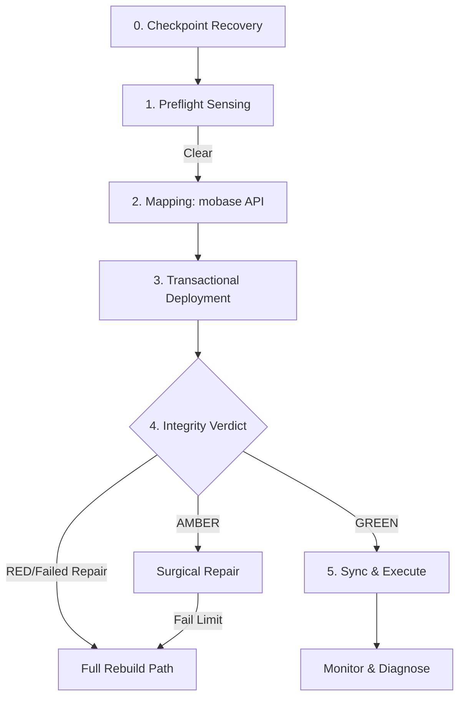

# GMN-FLOW-005-v3.2
> [!IMPORTANT]
> **Logic Dependencies**: Requires `GMN-PRD-005-v3.2`.

## 1. Metadata
| Field | Value |
| :--- | :--- |
| **Project ID** | 005 |
| **Document Type** | User / Logic Flow (FLOW) |
| **Version** | v3.2 |
| **Status** | Draft (Audit-Corrected) |
| **Lead Architect** | Gemini (GMN) |

---

## 2. Logic Overview
> **Scope:** This flow describes the resilient, state-aware lifecycle of the v4.0 engine. It now includes explicit Checkpoint Recovery and Loop-Exit conditions.

---

## 3. Sequential Logic (The Resilient Loop)

### Phase 0: Checkpoint Recovery
0.  **Check `.deployment_state`**: If "Incomplete" build detected, prompt user: [Resume from Checkpoint] or [Start Fresh].
    *   **Resume**: Jump to Phase 3 (Step 8) with existing manifest.

### Phase 1: Preflight Sensing
1.  **Sense Environment**: Probe target for OneDrive/Defender conflicts.
2.  **Lock Audit**: Detect PIDs holding game files.
3.  **Actionable Branch**: Pause -> Show Attribution Report -> [Retry/Abort].

### Phase 2: Mapping (mobase API)
4.  **API Map**: Call `mobase` API for 100% accurate load order (No heuristic guessing).
5.  **Delta Analysis**: Compare new manifest vs. old state.
6.  **Uncertainty Threshold**: If delta > 70% of total file count -> **Force Full Rebuild**.

### Phase 3: Transactional Deployment
7.  **Surgical Cleanup**: Delete files removed in Delta.
8.  **Atomic Deployment**: Link/Copy new files.
9.  **Checkpointing**: Save progress to `.deployment_state` every 500 files.

### Phase 4: Integrity Verdict
10. **Tiered Integrity Pass**: Metadata check + 5% Hash sampling.
11. **Global Integrity Verdict**:
    *   **Verdict GREEN**: Proceed.
    *   **Verdict AMBER**: [Surgical Repair].
        *   **Repair Loop**: If Repair fails > 3 times -> **Force Full Rebuild**.
    *   **Verdict RED**: **Force Full Rebuild**.

### Phase 5: Execute & Sync
12. **Sync Configs/Saves**: Use C# module for atomic file moving to avoid V3 "Save Mismatch."
13. **Launch Wrapper**: Monitor for crashes (Failure Attribution).
14. **Close-Sync**: Move Saves back to MO2.

---

## 4. Visual Logic (Branching Diagram)

