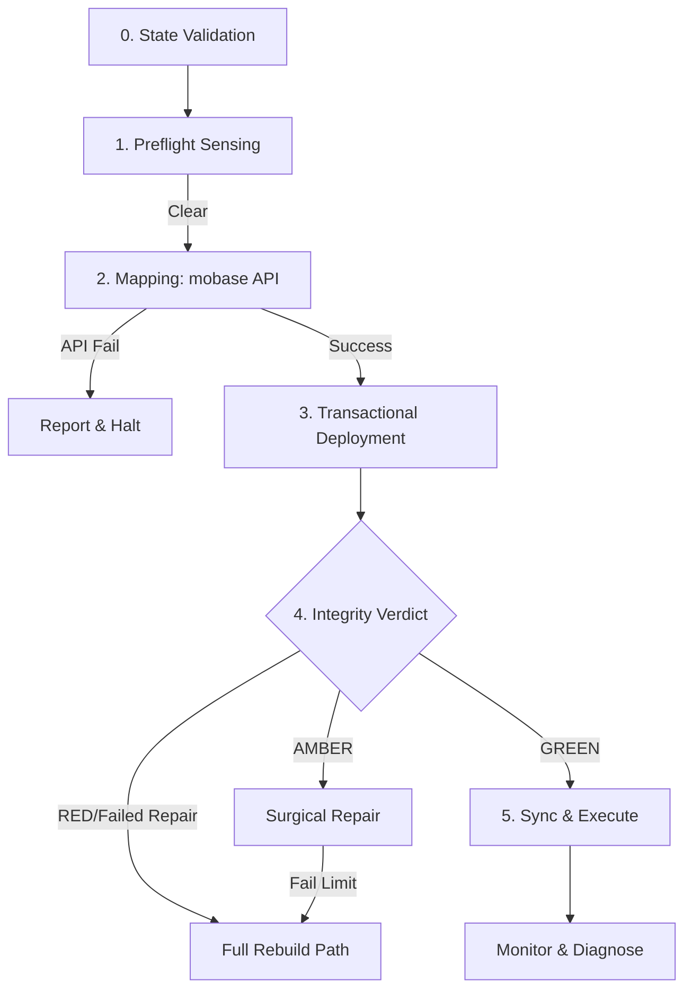

# GMN-FLOW-005-v3.3
> [!IMPORTANT]
> **Logic Dependencies**: Requires `GMN-PRD-005-v3.3`. Incorporates Implementation Warnings from GPT-AUD1-v3.2.

## 1. Metadata
| Field | Value |
| :--- | :--- |
| **Project ID** | 005 |
| **Document Type** | User / Logic Flow (FLOW) |
| **Version** | v3.3 |
| **Status** | Implementation-Ready |
| **Lead Architect** | Gemini (GMN) |

---

## 2. Logic Overview
> **Scope:** This flow describes the resilient, state-aware lifecycle of the v4.0 engine. It prioritizes **Early Error Attribution**, **Recoverable States**, and **State Parity**.

---

## 3. Sequential Logic (The Resilient Loop)

### Phase 0: Checkpoint Recovery
0.  **Validate `.deployment_state`**: Perform checksum/schema check. If invalid, **Force Full Rebuild**. 
1.  **Resume Prompt**: If valid and "Incomplete", prompt user to Resume.

### Phase 1: Preflight Sensing
2.  **Sense Environment**: Probe target for OneDrive/Defender conflicts.
3.  **Lock Audit**: Detect PIDs holding game files.
4.  **Actionable Branch**: Pause -> Show Attribution Report -> [Retry/Abort].

### Phase 2: Mapping (mobase API)
5.  **API Map**: Call `mobase` API. 
    *   **Fallback**: If API unavailable -> Halt and report "API Link Failure".
6.  **Delta Analysis**: Compare manifest vs. old state.
7.  **Uncertainty Threshold**: If delta > 70% (Configurable per profile) -> **Force Full Rebuild**.

### Phase 3: Transactional Deployment
8.  **Surgical Cleanup**: Delete files removed in Delta.
9.  **Atomic Deployment**: Link/Copy new files.
10. **Immediate Inode Check**: Verify hardlink success.
11. **Checkpointing**: Save validated progress to `.deployment_state` every 500 files.

### Phase 4: Global Integrity Verdict
12. **Tiered Integrity Pass**: Metadata check + 5% Hash sampling (95% Confidence).
13. **Verdict Branching**:
    *   **Verdict GREEN**: Proceed.
    *   **Verdict AMBER**: [Surgical Repair].
        *   **Repair Exit**: If Repair fails > 3 times -> **Force Full Rebuild**.
    *   **Verdict RED**: **Force Full Rebuild**.

### Phase 5: Execute & Sync
14. **Atomic Sync**: Use C# module for atomic config/save moves.
15. **Launch Wrapper**: Monitor for crashes and environment conflicts.
16. **Post-Close Sync**: Move Saves back to MO2.

---

## 4. Visual Logic (Branching Diagram)

